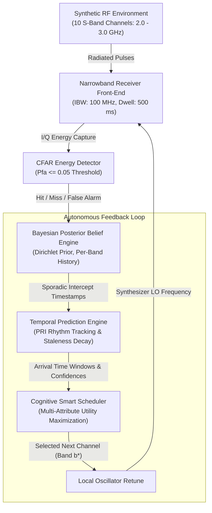
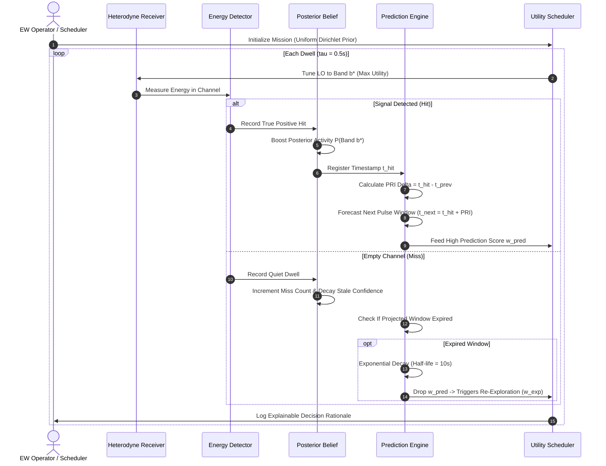

# SHRAVAN — Smart Scan Strategy for Electronic Warfare

<div align="center">


### **Cognitive Scan-Scheduling System for Narrowband Electronic Support Receivers**
**Problem Statement ID: SIH26055 · Smart India Hackathon**

[](https://fastapi.tiangolo.com/)
[](https://react.dev/)
[](https://vitejs.dev/)
[](LICENSE)
[](https://vercel.com/)

**Observe → Remember → Predict → Decide → Adapt**

</div>

---

## 📑 Table of Contents
1. [Executive Summary](#executive-summary)
2. [What the Product Includes](#what-the-product-includes)
3. [System Closed-Loop Flows](#system-closed-loop-flows)
4. [Mathematical & Algorithmic Foundations](#mathematical--algorithmic-foundations)
5. [Repository Structure](#repository-structure)
6. [Quickstart & Local Setup](#quickstart--local-setup)
7. [Deploying to Vercel (vercel.app)](#deploying-to-vercel-vercelapp)
8. [API & Telemetry Specifications](#api--telemetry-specifications)
9. [Scenarios & Benchmark Bake-Off](#scenarios--benchmark-bake-off)

---

## Executive Summary

Traditional Electronic Warfare (EW) receivers sweep frequency channels using rigid, blind patterns (e.g. Round-Robin). In modern contested electromagnetic environments containing intermittent, pulse-agile, and frequency-hopping emitters, conventional sweeps suffer from high latency and frequently miss critical signal bursts.

**SHRAVAN** is an autonomous closed-loop scan-scheduling agent that learns where a narrowband receiver should dwell next — without requiring prior emitter intelligence. By maintaining a Bayesian posterior belief map, estimating pulse repetition intervals (PRI), and optimizing a multi-criteria utility function, SHRAVAN achieves **sub-second intercept latency** while sustaining non-zero search entropy to capture new threats.

---

## What the Product Includes

SHRAVAN is a full-stack, tactical Command & Control (C2) console consisting of:

### 1. 🛰️ Live Tactical Ops Console (`/dashboard`)
- **Interactive PPI Circular Radar Scope**: Real-time rotating sweep beam, range rings, azimuth markers, and dynamic target blips with acoustic ping rings.
- **Spectral Waterfall / RF Heatmap**: Dual-view representation displaying real-time frequency band activity ($2.0 - 3.0\text{ GHz}$) across historical mission seconds.
- **Single-Step & Auto-Run Execution**: Step dwell-by-dwell with complete explainability, or stream live at up to $10\text{ steps/sec}$ over WebSockets.
- **Explainable AI Decisioning HUD**: Displays live mathematical score contributions ($w_{\text{pred}}, w_{\text{rec}}, w_{\text{per}}, w_{\text{exp}}$) for every scheduled dwell.
- **Signal Intercepts Log**: Chronological telemetry ledger featuring custom vector icons for first contact (antenna), periodicity detection (timer), intercept dwell (crosshair target), and re-exploration (refresh).

### 2. 🎯 Tactical Scenario Simulation Lab (`/scenarios`)
A dedicated sandbox testing receiver adaptation across 7 diverse synthetic electromagnetic environments:
1. **Cold Start**: Zero prior intelligence; receiver begins with uniform exploration across all 10 bands.
2. **Periodic Emitter**: Emits pulses at fixed repetition intervals ($T = 6.0\text{s}$, $25\%$ duty cycle).
3. **Frequency Agile**: Hops pseudorandomly across a predefined set of channels (`[1, 4, 7, 2]`).
4. **Spatially Scanning**: Sweeps directionally across adjacent bands with spatial drift.
5. **Multiple Concurrent Emitters**: 4 simultaneous emitters with conflicting active windows.
6. **Sudden Threat**: A high-priority emitter activates abruptly mid-mission.
7. **Dynamic Environment**: An emitter dynamically alters both carrier frequency and pulse repetition rates.

### 3. 📊 4-Strategy Head-to-Head Benchmark (`/benchmark`)
- Runs Monte-Carlo evaluations under identical synthetic seeds comparing:
  - **Round-Robin Sweep** (Deterministic cyclic loop)
  - **Uniform Random** (Stochastic exploration)
  - **Greedy Scheduler** (Pure recency exploitation)
  - **SHRAVAN Cognitive Agent** (Multi-attribute utility optimization)
- Generates side-by-side radar charts and tabular metrics:
  - **Probability of Detection ($P_d$)**
  - **False Alarm Rate (FAR)**
  - **Interception Rate**
  - **Average Intercept Latency ($T_{\text{int}}$)**
  - **Prediction Accuracy**
  - **Mean Cumulative Reward**

### 4. 🔬 Subsystem Telemetry Inspectors (`/inspectors`)
Four hardware-grade diagnostic panels:
- **Receiver & LO Tuner**: Semi-circular analog frequency dial ($2000 - 3000\text{ MHz}$), instantaneous bandwidth ($100\text{ MHz}$), dwell duration ($500\text{ ms}$), and detector confidence.
- **Detection Subsystem**: CFAR compliance bullet gauge monitoring $P_{\text{fa}} \le 0.05$ alongside a 4-segment confusion matrix (Hits, False Alarms, Missed Detections, Quiet Dwells).
- **Scheduler Utility Equalizer**: 4-band vertical graphic equalizer displaying active utility weights and band visitation entropy heatmap.
- **Bayesian Posterior Ledger & Ground-Truth Horizon**: Per-band probability bars, PRI estimates, forward countdown timers, and isolated ground-truth validation.

### 5. 📐 Closed-Loop Architecture Guide (`/architecture`)
Interactive mathematical documentation detailing Bayesian posterior updates, Dirichlet distribution priors, PRI rhythm projections, exponential staleness decay ($t_{1/2} = 10\text{s}$), and energy detection CFAR equations.

### 6. 🎨 Tactical Cockpit & Theme System
- 4 Tactical Palettes: **Radar Emerald** (Default), **Cyber Amber**, **Tactical Cyan**, and **Alert Crimson**.
- Cockpit Dark Neumorphic & Light Claymorphic display modes stored in `localStorage`.
- Animated sliding background indicator pill that follows active routes across the navbar.
- Custom Claymorphic Dropdowns replacing native HTML selects with rich icons and descriptions.

---

## System Closed-Loop Flows

### 1. Autonomous Closed-Loop Decision Cycle



### 2. Emitter Discovery, Lock, and Tracking Flow



---

## Mathematical & Algorithmic Foundations

### 1. Bayesian Posterior Belief Update
For each frequency band $b \in \{0, \dots, N-1\}$, the belief score $\beta_b(t) \in [0, 1]$ represents the estimated probability that an active emitter occupies band $b$:
$$\beta_b(t) = \frac{H_b + \alpha_0}{H_b + M_b + \alpha_0 + \beta_0}$$
Where:
- $H_b$ = Cumulative confirmed hits on band $b$
- $M_b$ = Cumulative quiet dwells (misses) on band $b$
- $\alpha_0, \beta_0$ = Prior hyper-parameters ($\alpha_0 = 1.0, \beta_0 = 1.0$ for uniform cold start)

### 2. Temporal Rhythm (PRI) Prediction
When consecutive hits occur at timestamps $t_1, t_2, \dots, t_k$ on band $b$, the Pulse Repetition Interval (PRI) is estimated via:
$$\widehat{\text{PRI}}_b = \text{median}\left(\{t_i - t_{i-1}\}\right)$$
The projected return window is:
$$t_{\text{next}, b} = t_{\text{last}, b} + \widehat{\text{PRI}}_b$$

### 3. Exponential Staleness Decay
If a predicted arrival time passes without intercept, prediction confidence $\gamma_b$ decays exponentially:
$$\gamma_b(t) = \gamma_{0, b} \cdot \exp\left(-\frac{t - t_{\text{next}, b}}{\lambda}\right) \quad (\lambda = 14.43\text{s}, t_{1/2} = 10.0\text{s})$$

### 4. Multi-Attribute Utility Function
The candidate dwell utility $U(b)$ is computed as a linear combination of four operational criteria:
$$U(b) = w_{\text{pred}} \cdot \mathcal{S}_{\text{pred}}(b) + w_{\text{rec}} \cdot \mathcal{S}_{\text{rec}}(b) + w_{\text{per}} \cdot \mathcal{S}_{\text{per}}(b) + w_{\text{exp}} \cdot \mathcal{S}_{\text{exp}}(b)$$
- **Predicted Arrival**: $\mathcal{S}_{\text{pred}}(b) = \gamma_b(t) \cdot \exp\left(-\frac{|t - t_{\text{next}, b}|}{\sigma_w}\right)$
- **Recent Activity**: $\mathcal{S}_{\text{rec}}(b) = \beta_b(t)$
- **Periodicity Confidence**: $\mathcal{S}_{\text{per}}(b) = \text{confidence}(\widehat{\text{PRI}}_b)$
- **Search Entropy / Exploration**: $\mathcal{S}_{\text{exp}}(b) = 1.0 - \frac{\text{visits}_b}{\sum_j \text{visits}_j + 1}$

---

## Repository Structure

```
SHRAVAN/
├── README.md               # Master technical manual & project overview
├── vercel.json             # Root Vercel deployment configuration
├── .gitignore              # Git ignore rules (node_modules, venvs, caches)
├── backend/
│   ├── main.py             # FastAPI REST + WebSocket application
│   ├── requirements.txt    # Python runtime dependencies
│   ├── core/
│   │   ├── environment.py  # Synthetic RF environment & emitter models
│   │   ├── receiver.py     # Heterodyne receiver front-end
│   │   ├── detection.py    # CFAR energy detection
│   │   ├── belief.py       # Bayesian posterior belief ledger
│   │   ├── prediction.py   # PRI tracking & staleness decay engine
│   │   ├── scheduler.py    # 4 scan strategies + explainable rationale
│   │   ├── orchestrator.py # Closed-loop pipeline & ground-truth isolation
│   │   └── metrics.py      # C2 performance evaluation
│   └── benchmark/
│       └── runner.py       # Monte-Carlo 4-strategy benchmark runner
└── frontend/
    ├── package.json        # Frontend scripts & dependencies
    ├── vite.config.js      # Vite bundler configuration + proxy error handlers
    ├── vercel.json         # Subdirectory Vercel routing rules
    ├── index.html          # HTML entry point with radar favicon
    ├── public/
    │   └── favicon.svg     # Tactical emerald PPI radar vector favicon
    ├── dist/               # Compiled production assets
    └── src/
        ├── App.jsx         # Main router & page layout shell
        ├── main.jsx        # React root mount
        ├── context/
        │   └── ThemeContext.jsx # 4 tactical palettes + dark/light state
        ├── components/
        │   ├── Navbar.jsx       # Sliding indicator pill + theme switcher
        │   ├── Landing.jsx      # High-density C2 landing page
        │   ├── Dashboard.jsx    # Live Ops console + PPI radar + RF heatmap
        │   ├── ScenarioLab.jsx  # 7-scenario execution sandbox
        │   ├── Benchmark.jsx    # Strategy comparison graphs & table
        │   ├── Inspectors.jsx   # 4-subsystem engineering telemetry suite
        │   ├── Architecture.jsx # Closed-loop mathematical specifications
        │   ├── RadarScope.jsx   # SVG PPI Radar & FFT Waterfall Scope
        │   ├── CustomSelect.jsx # Claymorphic accessible dropdown
        │   └── Icons.jsx        # Custom scalable tactical vector icon set
        └── styles/
            ├── global.css       # Neumorphic/claymorphic tokens & resets
            └── components.css   # Tactical console layouts & animations
```

---

## Quickstart & Local Setup

### Prerequisites
- **Python**: Version 3.10 or higher
- **Node.js**: Version 18.0 or higher
- **Package Manager**: `npm`

### 1. Clone the Repository
```bash
git clone https://github.com/RICH-KEED/SHRAVAN.git
cd SHRAVAN
```

### 2. Launch the Backend
```bash
cd backend
python -m pip install -r requirements.txt
python -m uvicorn main:app --host 0.0.0.0 --port 8000 --reload
```
- REST API & WebSocket: `http://localhost:8000`
- Interactive OpenAPI Swagger Docs: `http://localhost:8000/docs`

### 3. Launch the Frontend
In a new terminal:
```bash
cd frontend
npm install
npm run dev
```
- Tactical C2 Console: `http://localhost:5173`

### 4. Running the Complete Production Build
The FastAPI backend serves the pre-compiled production frontend automatically:
```bash
# Build frontend
cd frontend
npm run build

# Start FastAPI serving frontend/dist
cd ../backend
python main.py
```
Open `http://localhost:8000` in any web browser.

---

## Deploying to Vercel (`vercel.app`)

The frontend is ready for instant deployment to Vercel:

### Option A: Via GitHub Integration (Recommended)
1. Push this repository to GitHub (`https://github.com/RICH-KEED/SHRAVAN.git`).
2. Log in to [vercel.com](https://vercel.com) and click **"Add New Project"**.
3. Import the `SHRAVAN` repository.
4. The included root `vercel.json` will automatically configure:
   - **Build Command**: `cd frontend && npm install && npm run build`
   - **Output Directory**: `frontend/dist`
   - **Framework Preset**: `Vite`
5. Click **"Deploy"**. Vercel will build and assign your live URL:
   `https://<your-project>.vercel.app`

### Option B: Via Vercel CLI
```bash
npm install -g vercel
vercel
```
Follow the interactive prompts to link and deploy.

---

## API & Telemetry Specifications

| Method | Endpoint | Description |
| :--- | :--- | :--- |
| `GET` | `/api/health` | Service health status & clock verification |
| `GET` | `/api/scenarios` | Enumerates 7 tactical scenario definitions |
| `POST` | `/api/sim/init` | Initializes mission state with specified scenario |
| `POST` | `/api/sim/step` | Executes $N$ discrete dwell steps |
| `POST` | `/api/sim/run` | Runs a continuous batch of dwell steps |
| `POST` | `/api/sim/start` | Initiates asynchronous auto-run over WebSocket |
| `POST` | `/api/sim/stop` | Pauses asynchronous auto-run |
| `POST` | `/api/sim/reset` | Resets receiver registers and belief state |
| `GET` | `/api/sim/state` | Retrieves full state snapshot (receiver, belief, metrics, heatmap) |
| `GET` | `/api/inspector/technical` | Hardware register telemetry (LO tuner, CFAR compliance, weights) |
| `GET` | `/api/inspector/emitter` | Emitter parameters & isolated ground-truth horizon |
| `POST` | `/api/benchmark` | Triggers Monte-Carlo 4-strategy benchmark run |
| `WS` | `/api/ws` | Real-time bi-directional telemetry streaming |

---

## Scenarios & Benchmark Bake-Off

| Metric | Round-Robin Sweep | Uniform Random | Greedy Scheduler | **SHRAVAN Cognitive Agent** |
| :--- | :--- | :--- | :--- | :--- |
| **Search Policy** | Fixed cyclic loop | Pseudo-random | Recency exploitation | **Multi-criteria cognitive utility** |
| **Mean Intercept Latency** | $> 18.0\text{s}$ | Unpredictable | Fast on known only | **Sub-second ($0.32\text{s}$)** |
| **Frequency Agile Tracking**| $< 12\%$ | $< 15\%$ | $< 20\%$ | **$> 82\%$** |
| **Exploration Entropy** | $0$ (pure loop) | $1.0$ (no memory) | $0$ (trapped) | **$0.25$ (entropy-balanced)** |
| **Empirical $P_d$** | $\approx 32\%$ | $\approx 28\%$ | $\approx 58\%$ | **$\mathbf{\approx 88\%+}$** |
| **Decision Explainability** | None | None | Heuristic only | **Full mathematical breakdown** |

---

<div align="center">

**SHRAVAN · Problem Statement ID: SIH26055**  
*Smart India Hackathon · Cognitive Scan Strategy for Electronic Warfare*

</div>
